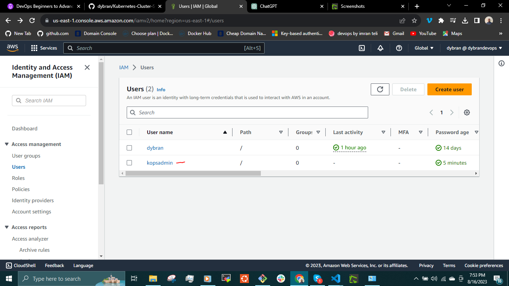
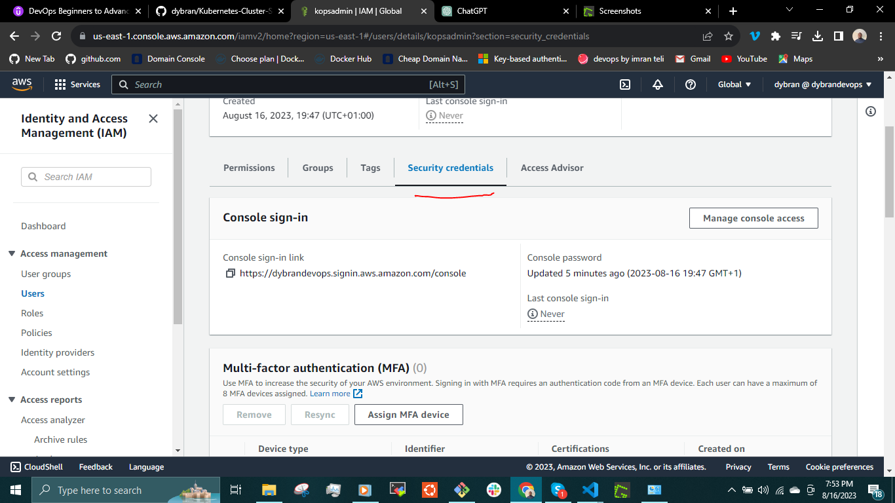
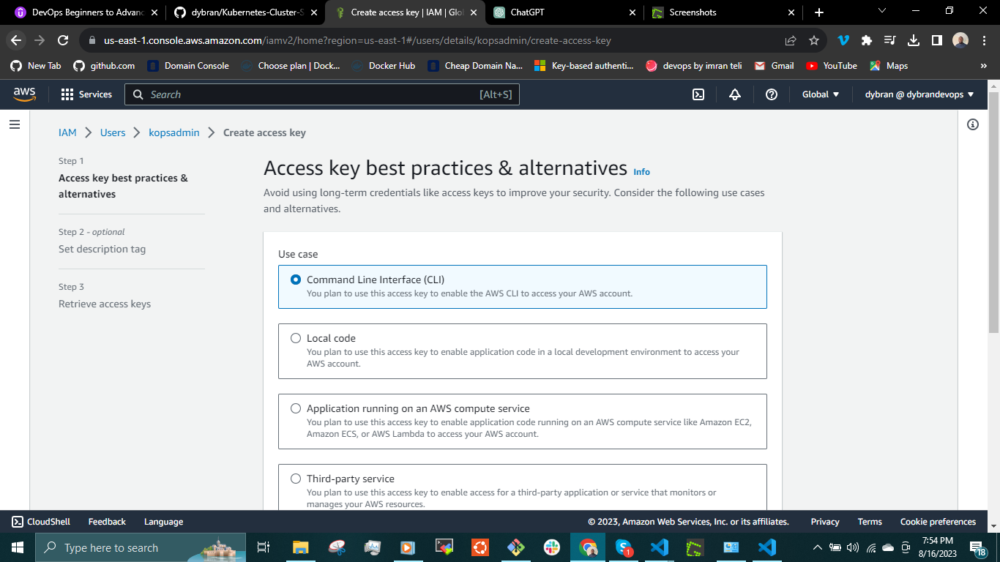

### __KUBERNETES SETUP WITH KUBERNETES OPERATIONS(KOPS)__

__Kops - Kubernetes Operations__ is a tool that helps you create, upgrade, and manage Kubernetes clusters on cloud infrastructure providers like AWS, GCP and more. Setting up Kubernetes using __Kops__ involves several steps.

__Prerequisites:__

- A domain name for Kubernetes DNS record - __mydevopsproject.top__.
- AWS account

__Task:__

- Log into AWS account:
  - Create an ubuntu Instance.
  - Create __S3 bucket__.
  - Create an __IAM user__ for awscli.
  - Create __Route 53__ hosted zone.

- SSH into the instance
- Setup the following:
   - kops
   - kubectl
   - awscli
   - ssh keys

Purchase a domain name from a domain name provider. eg godaddy.com and namesilo.com etc.

Create an ubuntu EC2 instance for Kops

Create S3 bucket

Kops will establish a cluster and utilize awscli for interaction with AWS services. To enable access to these services via awscli commands, valid credentials are essential. This can be achieved through two approaches:

- Establishing an IAM role and linking it to the kops instance.
- Generating access keys and securely storing them within the instance.
- 
For my implementation, I will opt to create an IAM role, endowing it with extensive permissions (specifically administrator access). This decision is rooted in the fact that this IAM role will need to interact with a multitude of services such as S3 buckets and Route53. Subsequently, I will link this IAM role to the instance.

Create Hosted zone in Route53

This creates the __ns servers url__ which we will add to the domain servers register in the DNS provider - __www.namesilo.com__

Log into your DNS provider account and update the name servers with the __ns server url__ that was created earlier

